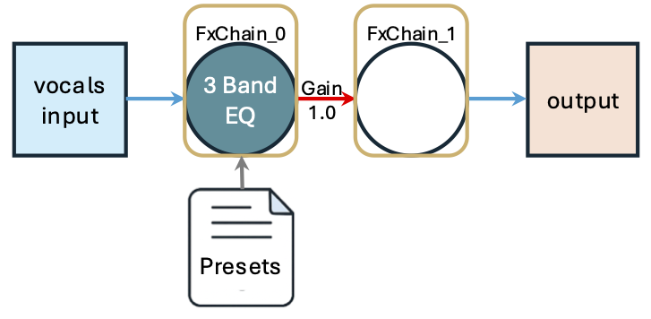
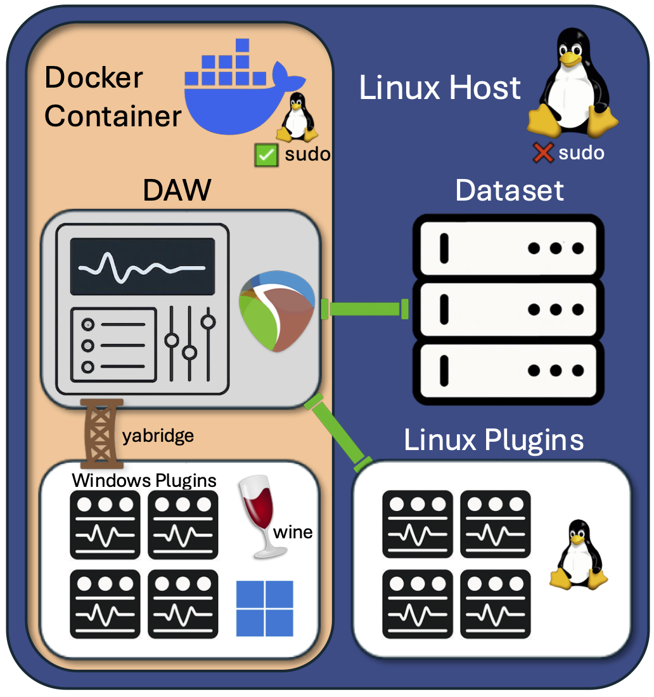
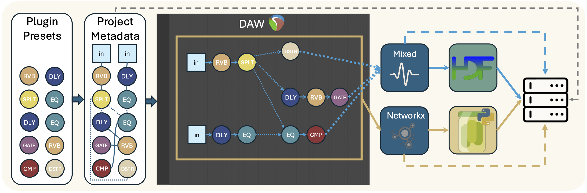
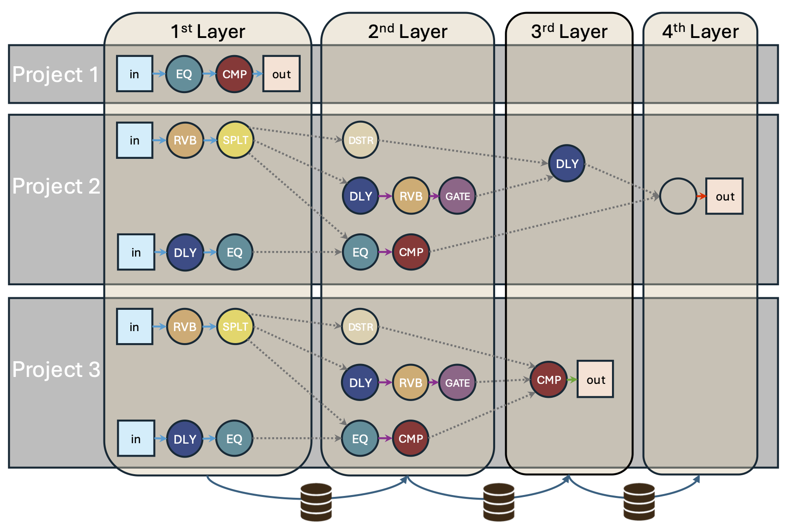

<div align="center">
  
</div>

# WildFX: A DAW-Powered Pipeline for In-the-Wild Audio FX Graph Modeling
This Repo is the official implementation of WildFX Dataset Generating pipeline.

We introduce WildFX, the first comprehensive end-to-end pipeline (to the best of our knowledge) for interfacing with and generating multitrack music datasets with heterogeneous AFx graphs derived from universal plugins including real, commercial plugin chains using Python. WildFX is containerized with Docker, enabling efficient execution of a professional DAW backend (specifically REAPER) on Linux-based research systems—environments where audio production software typically does not run natively. This architecture supports seamless integration of arbitrary commercial plugins across multiple formats (VST/VST3/LV2/CLAP), allowing researchers to capture the full complexity of professional audio processing, including advanced routing schemes such as sidechaining and multiband processing.
## 0. Metadata Samples with Demontrative Figure
### YAML Project Metadata Example
<pre><code class="language-yaml">
FxChains:
  - FxChain:
      - fx_name: "VST3: 3 Band EQ"
        fx_type: "eq"
        preset_index: 2
        params: []
        sidechain_input: null
    next_chains:
      1: 1
  - FxChain: []

input_audios:
  - audio_path: "vocals.wav"
    audio_type: "vocal"
    input_FxChain: 0

output_audio: "mixed_output.wav"
customized: true
</code></pre>

<pre><code class="language-json">
### JSON Plugin Preset Example
{
  "fx_name": "VST3: 3 Band EQ",
  "fx_type": "eq",
  "n_inputs": 2,
  "n_outputs": 2,
  "valid_params": {
    "Low": [0.0, 0.01, "...", 1.0],
    "Mid": [0.0, 0.01, "...", 1.0],
    "High": [0.0, 0.01, "...", 1.0]
  },
  "presets": [
    [null, null, null, 0.12, 0.69, 0.21],
    [null, null, null, 0.72, 0.63, 0.09],
    [null, null, null, 0.05, 0.00, 0.28]
  ]
}
</code></pre>

<p align="center">  
  <br>
  <em>Mixing Graph with the Provided Sample</em>
</p>

## 1. Docker Container Configuration

<div align="center">
  
    <br>
  <em>WildFX Deployment Environment</em>
</div>

### 1.1. Set up host machine
#### 1.1.a. [Install docker](https://docs.docker.com/engine/install/)

#### 1.1.b. Add current user to docker group (the only step requiring sudo if docker is already installed!)
```
sudo usermod -aG docker <username>
# Optional, if your server has audio hardware
sudo usermod -aG audio <username>
```

#### 1.1.c. Create plugin folders in home directory
```
mkdir -p ~/.vst ~/.vst3 ~/.clap ~/.lv2
# Alternatively in /usr/local/lib or /usr/local/lib64 (if plugin is 64-bit)
# mkdir -p /usr/local/lib/vst /usr/local/lib/vst3 /usr/local/lib/clap /usr/local/lib/lv2
# mkdir -p /usr/local/lib64/vst /usr/local/lib64/vst3 /usr/local/lib64/clap /usr/local/lib64/lv2
```
Those are the locations where you should put the plugins that you want to use to generate the dataset.
The Dev Container also creates any missing folders as empty mount points; it does
not install or copy plugins onto the host.

### 1.2. Container configuration

Open the repository with the VS Code **Dev Containers** extension. The checked-in configuration uses conservative CPU and memory defaults, JACK's dummy audio device, and read-only plugin mounts, so it works on a headless server without editing machine-specific CPU ranges or dataset paths.

The image is intentionally `linux/amd64`, matching REAPER, yabridge, and the supplied plugin set. It runs natively on the Linux test PC and through Docker's amd64 emulation on Apple Silicon.

The container copies plugins to its own internal folders while excluding `__MACOSX` archive metadata. This leaves the host folders unchanged and prevents REAPER from reporting the metadata copies as failed plugins. For a dataset, add only the bind mount needed for that run to your local Dev Container override.

The Dev Container automatically updates the internal user's UID/GID to match the host user.

### 1.3. Build docker container
The Dockerfile is already provided in `.devcontainer/Dockerfile`. You can conveniently build the container by the *Dev Containers* Plugin in VS Code. Manual building by `docker run`, but not recommended. For manual building, we provide `.devcontainer/entrypoint.sh` to initialize the DAW.

> **Note**: by this step you should successfully get inside the container, so the following steps you should run inside of the container.

### 1.4 Python dependencies
```
uv pip install --python /home/u1/miniconda3/bin/python -r requirements.txt
```

The Dev Container runs this command automatically. PyTorch and torchaudio use pinned CPU-only Linux wheels, so the rendering environment does not depend on an NVIDIA driver.

## 2. Install Plugins
### Install Linux plugins
You can either run the installation scripts from the provided or directly move the plugin files: `.vst`, `.vst3`, `clap`, `lv2` to the folders you made earlier to hold all your plugins.

### Install Windows plugins (.exe) via wine and yabridge
```
# Initialize wine environment
wine wineboot

# Run an application with a virtual display
xvfb-run wine <path-to-your-.exe-file> /silent # Many installers support silent mode

# Create directories for Linux VST plugins (if not exist)
mkdir -p ~/.vst ~/.vst3 ~/.clap ~/.lv2

# Add the VST2 and VST3 directory to yabridge
yabridgectl add "$HOME/.wine/drive_c/Program Files/Steinberg/VstPlugins"
yabridgectl add "$HOME/.wine/drive_c/Program Files/Common Files/VST3"

# Sync changes
yabridgectl sync
```


## 3. Start DAW (REAPER)
The container entrypoint starts JACK and REAPER, configures reapy once, and leaves REAPER running. To restart it manually, use
```
reaper -nosplash -nonewinst -noactivate &
```
or
```
tmux new-session -d -s reaper-session 'reaper -nosplash -nonewinst -noactivate' # Recommended, easier for managing
```
### 3.1. Test reapy connection
```
python utils/test_reapy.py
```
> If the test fails (either reporting error or stuck in importing), just try to kill REAPER by `tmux kill-session`, then reopen REAPER in the background.

## 4. Start Processing Your Dataset!
<div align="center">
  
      <br>
  <em>WildFX Workflow</em>
</div>


<div align="center">
  
        <br>
  <em>WildFX Batch Processing</em>
</div>


### 4.1. Get your installed plugin list
Sometimes after running this commands, you need to restart REAPER.
```
reaper utils/plugin_get_list.lua
```


### 4.2. Generate presets
#### 4.2.a. Add the plugins you want to use in a .csv file if you want to process multiple plugins
Here's how you would create a plugin list file:
```
VST3: Graphic Equalizer x16 Stereo (LSP VST3),eq
VST3: Gate (SocaLabs),compressor
VST3: ZamCompX2 (Damien Zammit),compressor
VST3: FlyingDelay (superflyDSP),delay
```
#### 4.2.b. Usage Examples
```
# Use a plugin list file
python gen_presets.py --plugin-list my_plugins.csv --input-audio /path/to/sample.wav

# Process a specific plugin with its type
python gen_presets.py \
  --plugin-name "VST3: ZamCompX2 (Damien Zammit)" compressor \
  --input-audio /path/to/sample.wav

# Use the reduced set with a custom input file
python gen_presets.py --use-reduced-set --input-audio "/path/to/your/sample.wav"

# Generate deterministic parameter presets without rendering/clustering
python gen_presets.py --plugin-list my_plugins.csv --no-cluster-validation
```

### 4.3 Define data collecting logic with your own dataset
Add data collecting case in function `locate_targeted_stems` of script `gen_projects.py`. We have provided the example we used to collect data we want for the [Slakh2100](http://www.slakh.com/) dataset.

### 4.4. Generate projects to YAML file
You can also read the docstrins in `gen_projects.py`
```
python gen_projects.py \
usage: gen_projects.py [-h] --dataset-name DATASET_NAME --dataset-dir DATASET_DIR --output-path OUTPUT_PATH --num-projects NUM_PROJECTS [--complexity COMPLEXITY] [--min-stems MIN_STEMS]
                       [--max-stems MAX_STEMS] [--max-chains MAX_CHAINS] [--min-chains MIN_CHAINS] [--sidechain-prob SIDECHAIN_PROB] [--splitter-prob SPLITTER_PROB] [--chain-depth CHAIN_DEPTH]
                       [--variable-density] [--density-range DENSITY_RANGE]

Generate audio mixing graphs from stems.

options:
  -h, --help            show this help message and exit
  --dataset-name DATASET_NAME
                        Identifier for the dataset.
  --dataset-dir DATASET_DIR
                        Root directory of dataset containing project folders.
  --output-path OUTPUT_PATH
                        Path to save generated projects metadata ending with ".yaml".
  --num-projects NUM_PROJECTS
                        Number of projects to generate.
  --complexity COMPLEXITY
                        Complexity level (0.0 to 1.0).
  --min-stems MIN_STEMS
                        Minimum number of stems to use per project.
  --max-stems MAX_STEMS
                        Maximum number of stems to use per project.
  --max-chains MAX_CHAINS
                        Maximum number of FX chains in a project.
  --min-chains MIN_CHAINS
                        Minimum number of FX chains in a project.
  --sidechain-prob SIDECHAIN_PROB
                        Chance of a compatible FX using sidechain.
  --splitter-prob SPLITTER_PROB
                        Chance of a chain ending with a splitter.
  --chain-depth CHAIN_DEPTH
                        Comma-separated probabilities for number of FX per chain.
  --variable-density    Randomly vary density parameters for each project instead of using fixed values
  --density-range DENSITY_RANGE
                        If variable-density is enabled, controls the range (+/-) for random variation
```

### 4.5. Render audio with REAPER and save the dataset

`--save-mode human-readable` creates WAV/YAML output, `training-ready` creates H5/pickle output, and `both` creates both. A nonzero exit code means the batch is incomplete; partial batch preparation and missing output files are treated as errors. Delay, echo, and reverb layers receive a three-second render tail by default.
```
python main.py \
  --metadata-yaml /path/to/metadata.yaml \
  --output-dir wildfx_output \
  --save-mode both \
  --render-tail-seconds 3
```

## 5. Build the DAFx presentation audio bundle

Inside the Dev Container, one command creates dry stems, the dry mix, three graph definitions, three rendered examples, matching 1920×1080 PNG/editable SVG diagrams, a numbered playback folder, and measured safety checks:

```
python presentation_demo.py --output-dir dafx_demo
```

To use your own musical material, place compatible stems in one folder and run:

```
python presentation_demo.py \
  --stems-dir /path/to/stems \
  --output-dir dafx_demo
```

Presentation stems must be finite, non-silent stereo files with one shared sample rate and peaks at or below 0.98.

The three examples demonstrate increasingly complex multitrack routing:

1. Each stem follows its own instrument-specific FX chain before the final merge.
2. Drums sidechain the bass while rhythm and music form separately processed submixes.
3. Nested rhythm/music submixes feed a three-band split, including cross-band sidechain compression, before the final merge.

The final files for the talk are `dafx_demo/dry_stems/`, `dafx_demo/playback/00_dry_mix.wav` through `03_graph_3.wav`, and the matching PNG/SVG files under `dafx_demo/diagrams/`. The diagrams are generated directly from the same `Project` objects used to render the audio, including sidechain routes and non-unity mix gains. Open `dafx_demo/playback/playback_order.m3u8` to play every dry stem, the dry mix, then graphs 1–3 in order. `manifest.json` records sample rate, duration, peak, RMS, spectral centroid, low/mid/high energy share, and each processed file's difference from the dry mix. The command fails and removes its partial demo directory instead of leaving a misleading bundle if any render is missing, silent, non-finite, identical to dry, or above the presentation peak limit.

For metadata/audio preparation without REAPER, add `--prepare-only`.

### Regression checks

Inside the container, run the fast deterministic tests with `pytest`. Before a release or presentation, also run the real REAPER/plugin experiments:

```
pytest -o addopts='' -m reaper -v
```

The integration tests render all five curated plugins and independently verify the `sidechain_input: 0` route, including its pre-fader control behavior and absence of control-tone leakage.


## Trouble Shooting
`DisabledDistAPIWarning: Can't reach distant API. Please start REAPER, or call reapy.config.enable_dist_api() from inside REAPER to enable distant API.
  warnings.warn(errors.DisabledDistAPIWarning())`: sometimes if leaving the container too long, jack service and REAPER would be automatically killed. Restart jack service by
```
jackd --no-realtime -d dummy -r 44100 -p 1024 &
# or if you have audio hardware
jackd -d alsa -d hw:0 -r 44100 -p 1024 -P &
```
and restart reaper by
```
tmux new-session -d -s reaper-session 'reaper -nosplash -nonewinst'
```
